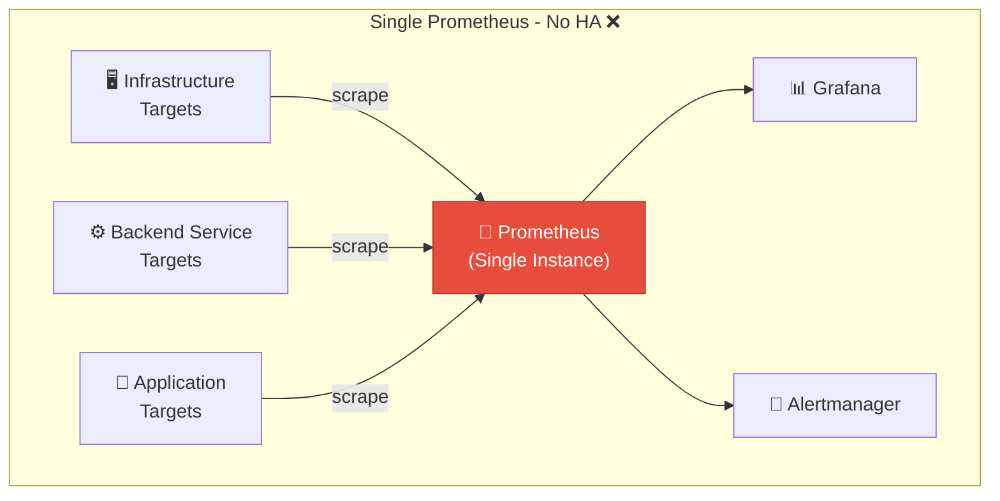
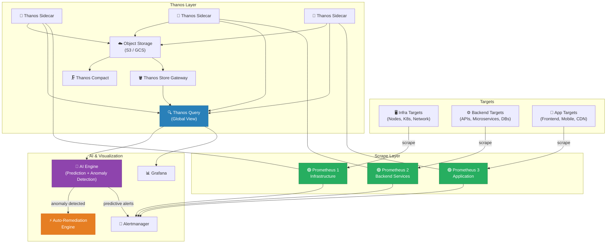
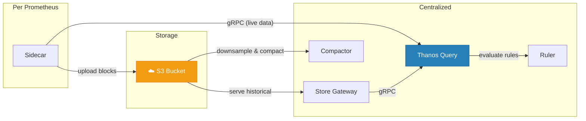
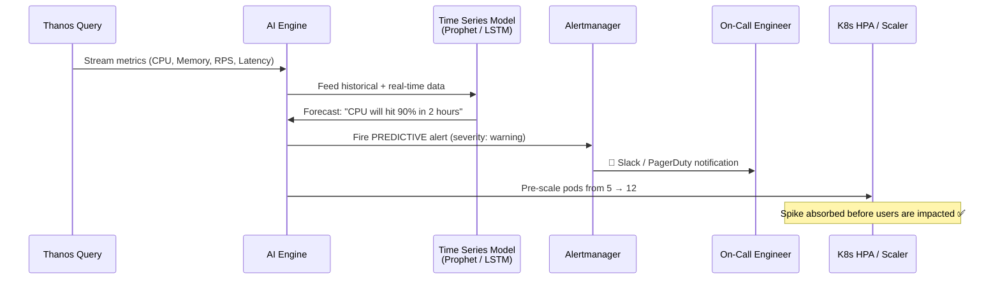
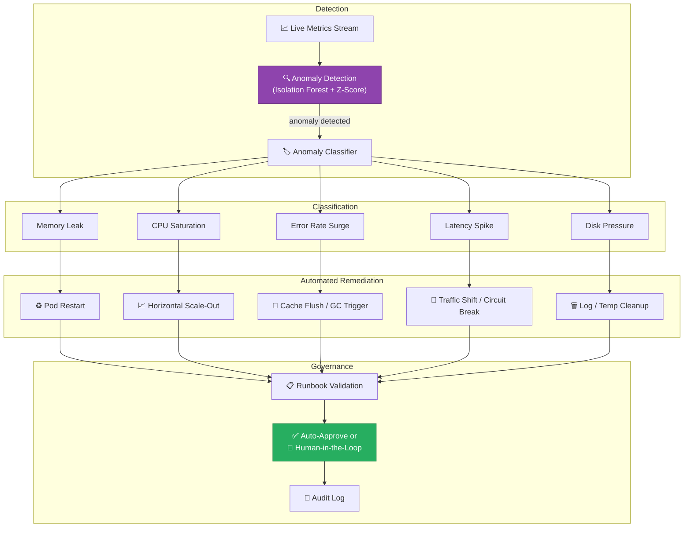
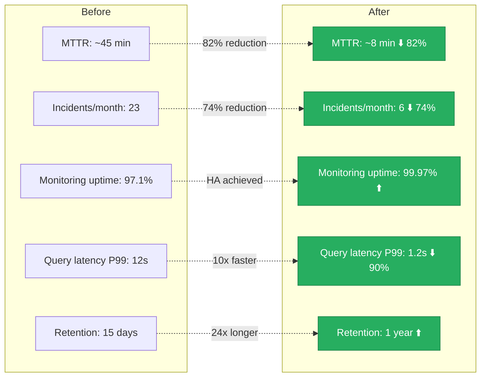
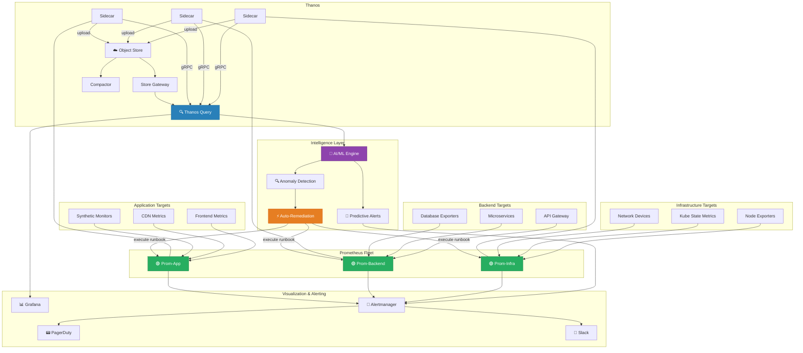

# From Single Prometheus to AI-Augmented Observability: How We Built a Resilient, Self-Healing DevOps Platform

*By gkfacebookgk · March 22, 2026 · 12 min read*

---

> **TL;DR:** We transformed our monitoring stack from a single Prometheus instance into a federated, high-availability architecture with three dedicated Prometheus servers, unified by Thanos — and then took it a step further by integrating AI for predictive scaling and automated anomaly remediation.

---

## 1. The Problem: A Single Point of Failure

Like many fast-growing engineering teams, we started with a single Prometheus instance scraping **everything** — infrastructure metrics, backend service health, and application-level telemetry. It worked… until it didn't.

### Pain Points We Faced

| Problem | Impact |
|---|---|
| **Single Point of Failure** | One Prometheus crash = total observability blackout |
| **Cardinality Explosion** | Millions of time series caused memory pressure and slow queries |
| **No Long-Term Storage** | Default 15-day retention meant we couldn't do historical analysis |
| **Blast Radius** | A misconfigured scrape target could degrade monitoring for *all* teams |
| **No Predictive Capability** | We were always *reacting* to incidents, never *preventing* them |

It was clear: we needed **High Availability**, **domain isolation**, and **intelligence** in our observability layer.

---

## 2. The Architecture: Before & After

### 🔴 BEFORE — Single Prometheus (No HA)



### 🟢 AFTER — Federated Prometheus + Thanos + AI



---

## 3. Step-by-Step: Splitting Prometheus into Three Domains

### Why Three? The Domain-Driven Monitoring Strategy

We didn't just split randomly — we aligned Prometheus instances with **ownership boundaries**:

| Prometheus Instance | Scope | Owned By | Example Metrics |
|---|---|---|---|
| **Prom-Infra** | Infrastructure | Platform / SRE Team | `node_cpu_seconds_total`, `kubelet_running_pods`, `node_memory_MemAvailable_bytes` |
| **Prom-Backend** | Backend Services | Backend Engineering | `http_request_duration_seconds`, `grpc_server_handled_total`, `db_query_duration_ms` |
| **Prom-App** | Application Layer | Product / Frontend | `app_page_load_time`, `app_crash_count`, `user_session_duration` |

### Key Configuration Highlights

Each Prometheus instance uses `external_labels` to identify itself to Thanos:

```yaml name=prometheus-infra.yml
# Prometheus 1 — Infrastructure
global:
  scrape_interval: 15s
  evaluation_interval: 15s
  external_labels:
    cluster: "production"
    prometheus_domain: "infrastructure"  # 👈 Thanos uses this for deduplication
    replica: "prom-infra-1"

scrape_configs:
  - job_name: 'node-exporter'
    kubernetes_sd_configs:
      - role: node
    relabel_configs:
      - source_labels: [__address__]
        regex: '(.+):(\d+)'
        target_label: __address__
        replacement: '${1}:9100'

  - job_name: 'kube-state-metrics'
    static_configs:
      - targets: ['kube-state-metrics.monitoring:8080']

  - job_name: 'kubelet'
    kubernetes_sd_configs:
      - role: node
    scheme: https
    tls_config:
      insecure_skip_verify: true
```

```yaml name=prometheus-backend.yml
# Prometheus 2 — Backend Services
global:
  scrape_interval: 10s
  evaluation_interval: 10s
  external_labels:
    cluster: "production"
    prometheus_domain: "backend-services"
    replica: "prom-backend-1"

scrape_configs:
  - job_name: 'api-gateway'
    metrics_path: /metrics
    kubernetes_sd_configs:
      - role: pod
    relabel_configs:
      - source_labels: [__meta_kubernetes_namespace]
        regex: 'backend.*'
        action: keep

  - job_name: 'database-exporters'
    static_configs:
      - targets:
        - 'postgres-exporter.monitoring:9187'
        - 'redis-exporter.monitoring:9121'
        - 'mongodb-exporter.monitoring:9216'
```

```yaml name=prometheus-application.yml
# Prometheus 3 — Application
global:
  scrape_interval: 30s
  evaluation_interval: 30s
  external_labels:
    cluster: "production"
    prometheus_domain: "application"
    replica: "prom-app-1"

scrape_configs:
  - job_name: 'frontend-metrics'
    static_configs:
      - targets: ['frontend-exporter.monitoring:9090']

  - job_name: 'cdn-metrics'
    static_configs:
      - targets: ['cdn-exporter.monitoring:9145']

  - job_name: 'synthetic-monitoring'
    metrics_path: /probe
    static_configs:
      - targets: ['blackbox-exporter.monitoring:9115']
```

---

## 4. Introducing Thanos: The Unified Query Layer

Thanos gave us three superpowers:

1. **Global Query View** — Query across all three Prometheus instances seamlessly
2. **Unlimited Retention** — Offload historical data to cheap object storage (S3/GCS)
3. **Deduplication** — Handle HA replica pairs without double-counting

### Thanos Components We Deployed



### Thanos Query Configuration

```yaml name=thanos-query-deployment.yml
apiVersion: apps/v1
kind: Deployment
metadata:
  name: thanos-query
  namespace: monitoring
spec:
  replicas: 2  # HA for the query layer itself
  template:
    spec:
      containers:
        - name: thanos-query
          image: quay.io/thanos/thanos:v0.36.1
          args:
            - query
            - --log.level=info
            - --query.replica-label=replica  # 👈 Deduplicates HA pairs
            - --store=dnssrv+_grpc._tcp.thanos-sidecar-infra.monitoring.svc
            - --store=dnssrv+_grpc._tcp.thanos-sidecar-backend.monitoring.svc
            - --store=dnssrv+_grpc._tcp.thanos-sidecar-app.monitoring.svc
            - --store=dnssrv+_grpc._tcp.thanos-store-gateway.monitoring.svc
          ports:
            - name: http
              containerPort: 10902
            - name: grpc
              containerPort: 10901
```

---

## 5. The AI Layer: From Reactive to Predictive DevOps

This is where things got truly exciting. We integrated an **AI/ML engine** that consumes metrics from Thanos Query and delivers two capabilities:

### 🔮 5a. Predictive Performance Analysis



**How it works:**
- We feed **4 weeks of historical metrics** into time-series forecasting models (we used a combination of **Facebook Prophet** for seasonality and **LSTM neural networks** for complex patterns)
- The AI engine queries Thanos every **5 minutes**, comparing real-time values against predicted baselines
- When the model predicts a threshold breach **30 minutes to 2 hours ahead**, it fires a **predictive alert** — giving us time to act *before* users are affected

**Real example from production:**
> On a Friday evening, the AI model predicted that our payment service would exhaust memory within 90 minutes based on a gradual leak pattern. The auto-scaler spun up additional pods while the on-call engineer investigated and deployed a fix — all **before a single user experienced an error**.

### 🔍 5b. Anomaly Detection & Auto-Remediation



**The key insight:** Not all anomalies are incidents, and not all incidents need a human. Our AI classifies anomalies and matches them to **pre-approved runbook actions**:

| Anomaly Type | Detection Method | Auto-Remediation Action | Human Approval Required? |
|---|---|---|---|
| Memory leak pattern | LSTM + trend analysis | Rolling pod restart | ❌ No (auto) |
| CPU saturation | Z-score > 3σ | HPA scale-out | ❌ No (auto) |
| Latency spike (P99) | Isolation Forest | Circuit breaker + traffic shift | ⚠️ Yes (if > 30% traffic) |
| Error rate surge (5xx) | Statistical threshold | Rollback last deployment | ✅ Yes (always) |
| Disk pressure | Linear projection | Temp file cleanup + alert | ❌ No (auto) |

---

## 6. Results: The Numbers Speak

After 3 months in production, here's what we measured:



| Metric | Before | After | Improvement |
|---|---|---|---|
| **Mean Time to Resolve (MTTR)** | ~45 min | ~8 min | ⬇️ 82% |
| **Monthly Incidents** | 23 | 6 | ⬇️ 74% |
| **Monitoring Uptime** | 97.1% | 99.97% | ⬆️ HA achieved |
| **Query Latency (P99)** | 12s | 1.2s | ⬇️ 10x faster |
| **Metric Retention** | 15 days | 1 year | ⬆️ 24x longer |
| **Proactive Incidents Prevented** | 0 | ~14/month | 🆕 New capability |

---

## 7. Lessons Learned

1. **Split by domain, not by team.** Aligning Prometheus instances with architectural boundaries (infra/backend/app) made ownership clear and reduced alert fatigue.

2. **Thanos Compactor is your silent hero.** Without regular compaction, your object storage costs will balloon. Run it on a schedule with sufficient memory.

3. **Start AI simple.** We began with basic Z-score anomaly detection before layering on ML models. Don't over-engineer from day one.

4. **Human-in-the-loop is non-negotiable for destructive actions.** Auto-remediations like pod restarts are safe; rollbacks should always require approval.

5. **External labels are everything.** A clean labeling strategy (`cluster`, `prometheus_domain`, `replica`) made Thanos deduplication and Grafana dashboards trivially easy.

---

## 8. What's Next

- **Federated Thanos across regions** — We're expanding to multi-cluster with Thanos Receive for remote-write from edge clusters
- **LLM-powered root cause analysis** — Using LLMs to correlate anomalies across metrics, logs, and traces for instant RCA summaries
- **Cost observability** — Adding cost-per-query and cost-per-service metrics into the same Thanos pipeline

---

## Final Architecture Overview



---

*If you're facing similar scaling challenges with your monitoring stack, I'd love to connect. Drop a comment or reach out — happy to share more details on the AI integration or Thanos configuration.*

**Tags:** `#DevOps` `#Prometheus` `#Thanos` `#AIOps` `#Observability` `#SRE` `#Kubernetes` `#MachineLearning`

---

*gkfacebookgk is a Lead DevOps Engineer passionate about building resilient, intelligent infrastructure at scale.*
